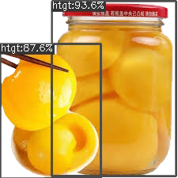

<div align="center"></div>


使用 YOLOX 检测图片中的**奶龙**、**动漫风格人物**、**龙图**等目标。

[💦 加入QQ群 (978132437)](http://qm.qq.com/cgi-bin/qm/qr?_wv=1027&k=fVZ60XVZ6_wLk98lP1JbrWz3uc3P6S-X&authKey=wIzFoJzUKrWzllsAuiF5FP7awwRgMmT455lv0ANnNY7CK4aIdslDfhKXWSvy4pJI&noverify=0&group_code=978132437)

你说上面那句话有个`等`字?



*黄桃罐头*: **你好**!

(正在测试中, 即将发布)

## 模型

请前往 [Releases](https://github.com/nkxingxh/NailongDetection/releases) 中下载模型。`labels.txt` 为分类标签文件。

### 评估

结果仅供参考。

| 模型 | 尺寸 | mAP<sup>val<br>0.5:0.95 | AP<sup><br>nailong | 评估验证集 | 镜像地址 |
|------|-------|-------------------------------|--------------------------|--------------|-----------|
| nailong_v2.5_tiny | 416,416 | 48.3 | 75.146 | v2.5 |
| nailong_v2.4_m | 640,640 | 48.3 | 71.763 | v2.5 |
| nailong_v2.4_tiny | 416,416 | 48.5 | 65.682 | v2.5 |
| nailong_v2.3_m | 640,640 | 52.0 | 82.614 | v2.4 | [下载](https://one.nkxingxh.top/xyund1/static/NailongDetection/nailong_v2.3_m.onnx) |
| nailong_v2.3_tiny | 416,416 | 51.7 | 68.940 | v2.3 | [下载](https://one.nkxingxh.top/xyund1/static/NailongDetection/nailong_v2.3_tiny.onnx) |
| nailong_v2.2_m | 640,640 | 51.5 | 83.335 | v2.3 |

## 使用

### 直接推理

请参考 [YOLOX 的 ONNX 推理脚本](https://github.com/Megvii-BaseDetection/YOLOX/blob/main/demo/ONNXRuntime/onnx_inference.py)。

```
python onnx_inference.py -m "nailong_v2_m.onnx" -i "输入图片" -o "输出目录" -s 0.3 --input_shape 640,640
```

### 搭建API服务

[nkxingxh/yolox-onnx-api-server](https://github.com/nkxingxh/yolox-onnx-api-server)

[搭建API服务](https://github.com/nkxingxh/yolox-onnx-api-server)给其他程序调用。

```
python server.py -m nailong_v2.1_m.onnx -l labels.txt
```

### MiraiEz 图片过滤

> MiraiEz 是一个支持 mirai-api-http 的 PHP 机器人框架。
> 方便、快速、高效地使用 PHP 编写你自己的 Bot。

[群图片过滤插件](https://github.com/nkxingxh/miraiez-plugins/blob/main/top.nkxingxh.miraiez.yolox.ImageFilter.php)

使用插件前, 需要先[搭建API服务](#搭建API服务)。

安装插件后, 在 BOT 所在的任意群发送一张任意图片, 插件会自动生成配置。

修改配置中的 `classes` 部分即可指定目标类别。具体选项说明请查看生成的配置文件。

```json
"classesDesc": "可以配置多个类别组",
"classes": [
    {
        "classId": [1],
        "className": ["nailong"],
        "score": 0.7,
        "actionDesc": "可以对每一组类别单独设置动作",
        "action": {
            "recall": false,
            "reply": "拒绝唐龙",
        },
    },
    {
        "classId": [],
        "className": ["long"],
        "score": 0.75,
        "action": {
            "recall": false,
            "reply": "龙图也是龙"
        }
    }
]
```

### nonebot-plugin-nailongremove

[Refound-445/nonebot-plugin-nailongremove](https://github.com/Refound-445/nonebot-plugin-nailongremove)

> NailongRemove 是一款奶龙识别插件，可以识别群中的奶龙表情包并撤回该表情。

安装插件后, 修改配置中的 `NAILONG_MODEL` 为 `1` 即可。

插件默认将使用最新版本的 tiny 模型。

### 其他

如果你的项目也使用了本模型, 可以打开 **Issue** 或者提交 **Pull request** 将你的项目添加在列表中。

## 声明

NailongDetection 根据 AGPL-3.0 许可证进行许可，有关详细信息，请参阅 [LICENSE](./LICENSE) 文件。

本项目仅用作学习 YOLOX 模型训练与推理，且本项目没有任何承诺与保证。
